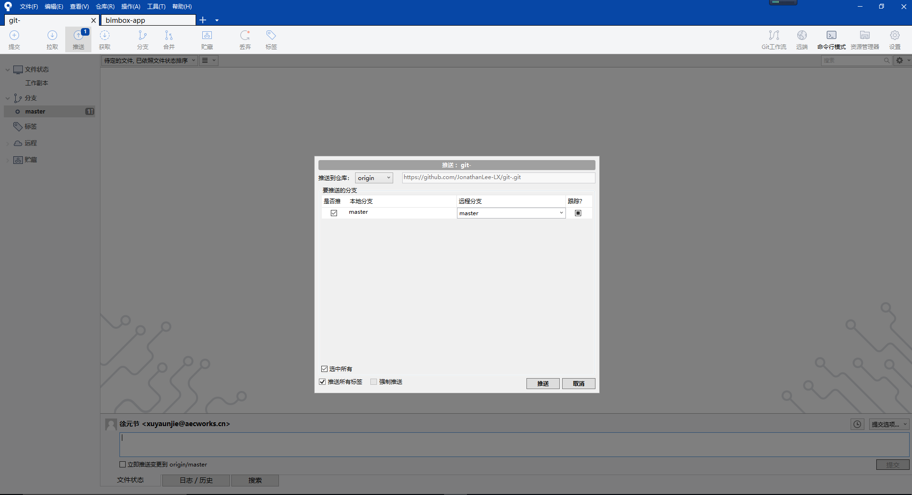

# git的基本操作和配置

## git的基本操作

## git的目录结构

在操作系统中，我们的仓库就是一个文件夹。但是为什么这些文件夹就是Git仓库呢？这是因为Git在初始化的时候会生成一个.git的文件夹，而Git进行版本控制所需要的文件，则都放在这个文件夹中

**核心文件**包括：config文件、objects文件夹、HEAD文件、index文件以及refs文件夹。

**config文件**：该文件主要记录针对该项目的一些**配置信息**，
通过`git remote add`命令增加的远程分支的信息就保存在这里；

**objects文件夹**：该文件夹主要包含**git对象**。Git中的文件和一些操作都会以git对象来保存，git对象分为BLOB、tree和commit三种类型

    例如git commit便是git中的commit对象，而各个版本之间是通过版本树来组织的，比如当前的HEAD会指向某个commit对象，而该commit对象又会指向几个BLOB对象或者tree对象。objects文件夹中会包含很多的子文件夹，其中Git对象保存在以其sha-1值的前两位为子文件夹、后38位位文件名的文件中；除此以外，Git为了节省存储对象所占用的磁盘空间，会定期对Git对象进行压缩和打包，其中pack文件夹用于存储打包压缩的对象，而info文件夹用于从打包的文件中查找git对象；

**HEAD文件**：该文件**指明了git branch（即当前分支）的结果**

**index文件**：该文件**保存了暂存区域的信息**。该文件某种程度就是缓冲区（staging area），内容包括它指向的文件的时间戳、文件名、sha1值等；

**Refs文件夹**：该文件夹存储指向**数据（分支）的提交对象的指针**。

    其中heads文件夹存储本地每一个分支最近一次commit的sha-1值（也就是commit对象的sha-1值），每个分支一个文件；remotes文件夹则记录你最后一次和每一个远程仓库的通信，Git会把你最后一次推送到这个remote的每个分支的值都记录在这个文件夹中；tag文件夹则是分支的别名，这里不需要对其有过多的了解；

### 工作原理

.git文件夹中包含了众多功能不一的文件夹和文件，这些文件夹和文件是描述Git仓库所必不可少的信息，不可以随意更改或删除；尤其需要注意的是，.git文件夹随着项目的演进，可能会变得越来越大，因为任何文件的任何一个变动，都需要Git在objects文件夹下将其重新存储为一个新的对象文件，因此如果一个文件非常大，那么你提交几次改动就会造成.git文件夹容量成倍增长。因此，.git文件夹更像是一本书，每一个版本的每一个变动都存储在这本书中，而且这本书还有一个目录，指明了不同的版本的变动内容存储在这本书的哪一页上，这就是Git的最基本的原理。

* **版本控制**：版本控制是一种记录一个或若干文件内容变化，以便将来查阅特定版本修订情况的系统。

1.  本地版本控制

        在硬盘上保存补丁集（补丁是指文件修订前后的变化）；通过应用所有的补丁，可以重新计算出各个版本的文件内容。

2.  集中化的版本控制

        如何让在不同系统上的开发者协同工作？

        有一个单一的集中管理的服务器，保存所有文件的修订版本，而协同工作的人们都通过客户端连到这台服务器，取出最新的文件或者提交更新。

        优点：每个人都可以在一定程度上看到项目中的其他人正在做些什么。 而管理员也可以轻松掌控每个开发者的权限，并且管理一个 CVCS 要远比在各个客户端上维护本地数据库来得轻松容易。

        缺点：中央服务器的单点故障

3.  分布式版本控制系统

        如何解决本地版本控制系统保存在单一位置

        任何一处协同工作用的服务器发生故障，事后都可以用任何一个镜像出来的本地仓库恢复。 因为每一次的克隆操作，实际上都是一次对代码仓库的完整备份。

## git的一些重要概念
### 三种状态
- 已提交(commited) 已提交表示文件已经安全存储在本地的git数据库中
- 已修改(modified) 已修改表示文件已经被修改了，并且没有被暂存
- 已暂存(staged) 已暂存表示对一个已修改文件的当前版本做了标记，使之包含在下次提交的快照中。

由此引入了git的三个工作区的概念。
### 三个工作区
- **git仓库** Git 仓库目录是 Git 用来保存项目的元数据和对象数据库的地方。 这是 Git 中最重要的部分，从其它计算机克隆仓库时，拷贝的就是这里的数据。
- 暂存区域 暂存区域是一个文件，保存了下次将提交的文件列表信息，一般在 Git 仓库目录中。 有时候也被称作`‘索引’'，不过一般说法还是叫暂存区域。
- 工作区 工作目录是对项目的某个版本独立提取出来的内容。 这些从 Git 仓库的压缩数据库中提取出来的文件，放在磁盘上供你使用或修改。

**基本的git工作流程**

1. 在工作目录中修改文件。

2. 暂存文件，将文件的快照放入暂存区域。

3. 提交更新，找到暂存区域的文件，将快照永久性存储到 Git 仓库目录。

# 常用命令

帮助 ：`git help <verb> / git <verb> --help / man git-<verb>`

 推送文件四部曲 ：

    1. git add

    2. git status

    3. git commit / git commit -m ''

    4. git push

跳过使用暂存区域的方式 : `git commit -a -m 'added new benchmarks'`

从已跟踪文件清单中移除文件 ： `git rm`

想让文件保留在磁盘，但是并不想让 Git 继续跟踪 ：`git rm --cached README`

重命名 : `git mv file_from file_to`

查看提交历史 ： `git log`

    常用的选项:
    -p ：按补丁格式显示每个更新之间的差异
    --stat ：每次提交文件的简略的统计信息
    --pretty ：指定使用不同于默认格式的方式展示提交历史
        子选项 ：
            oneline  将每个提交放在一行显示 例 git log --pretty=oneline
            short ：
            full :
            fuller :
            format ：可以定制要显示的记录格式
            graph ：展示分支、合并历史 例 git log --pretty=format:"%h %s" --graph

>  --graph需要与oneline 或 format 选项 结合使用时

按照时间做限制 ： `--since 和 --until `

例 ：`git log --since=2.weeks` 列出所有最近两周内的提交

显示指定作者的提交 ： `git log --author`

搜索提交说明中的关键字 ： `git log --grep`

> 注意： 如果要得到同时满足这两个选项搜索条件的提交，就必须用 --all-match 选项。否则，满足任意一个条件的提交都会被匹配出来

列出那些添加或移除了某些字符串的提交 : `git log -Sfunction_name`

只关心某些文件或者目录的历史提交 : `git log --path`

撤销操作 ： `git commit --amend`

取消暂存文件 ：` git reset HEAD <file>`

撤销对文件的修改 ：`git checkout -- <file>`

**常用命令**
- `git checkout .` 忽略所有的工作区改动
- `git checkout [commitId] [file]` 将指定文件恢复到指定提交的状态

查看已经配置的远程仓库服务器 ：`git remote`

    子选项：
        -v ：显示需要读写远程仓库使用的 Git 保存的简写与其对应的 URL

添加远程仓库 ： `git remote add <shortname> <url>`

远程仓库中获得数据 ：`git fetch [remote-name]`

自动的抓取然后合并远程分支到当前分支 ：`git pull`

克隆一个仓库 ：`git clone <url>`

推送到远程仓库 ：`git push [remote-name] [branch-name]`

例 将 master 分支推送到 origin 服务器 ：`git push origin master`

查看某一个远程仓库 ：`git remote show [remote-name]`

     查看更多信息 ：`git remote show`

远程仓库重命名 ：`git remote rename`

例 将 pb 重命名为 paul ：`git remote rename pb paul`

远程仓库移除 ：`git remote rm [remote-name]`

列出标签 ：`git tag`

创建标签：

     轻量标签：它只是一个特定提交的引用。如果你只是想用一个临时的标签，或者因为某些原因不想要保存那些信息，也用轻量化标签
     附注标签（建议使用）：附注标签是存储在 Git 数据库中的一个完整对象。它们是可以被校验的；其中包含打标签者的名字、电子邮件地址、日期时间；还有一个标签信息；并且可以使用 GNU Privacy Guard （GPG）签名与验证。

创建轻量标签 ：`git tag [tag-name]`

创建附注标签：`git tag -a`

> 一般与`-m''`搭配使用 例 git tag -a v3 -m 'BIMBox version 3'

对过去的提交打标签 ：`git tag -a [tag-name] [sha1]`

共享标签 ：` git push origin [tag-name]`

    一次推送多个标签 ：`git push origin --tags`

> 默认情况下，git push命令并不会传送标签到远程仓库服务器上。在创建完标签后，你必须显示地推送标签到共享服务器上 即 共享标签

检出标签 ： `git checkout -b [branchname] [tagname]`

> Git中不能真的检出一个标签，因为他们并不能像分支一样来回移动。如果想要工作目录与仓库中特定地标签版本完全一致，可以使用git checkout -b [分支名] [标签名]在特定地标签上创建一个新分支。

git别名 ：`git config --global alias.[别名] [命令名]`

例 将commit 用简写ci代替 git config --global alias.ci commit
即 需要输入 git commit 时，只需要输入 git ci

## git的配置

### git的全局配置和仓库级别的配置

全局配置用户信息 ： 

`git config --global user.name ""`

`git config --global user.email [email-name]`

查看配置信息 ：`git config --list`

> 可以通过输入 `git config <key>`  来检查 Git 的某一项配置 例 `git config user.name`检查用户名
即 需要输入 git commit 时，只需要输入 git ci

### 代码提交前需要进行的配置

### hook的配置

## Sourcetree 的基本工作流程

